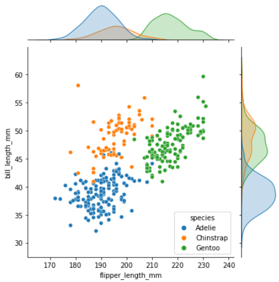

# Basics of Python Packages

Prepared by: Eldion Vincent H. Bartolo

## :books: Table of Contents

* [Seaborn](#Seaborn)
* [Pandas](#Pandas)
* [SkLearn](#SkLearn)
* [Optimization Packages](#Optimization-Packages)

## Seaborn
```python
# Install Seaborn
!pip install seaborn
```




## Pandas

## SkLearn

## Scipy

<details>
  <summary>Version of Packages Used</summary>

|       | Python  | Seaborn | Pandas | SkLearn | Scipy |
| :---: | :---: | :---: | :---: | :---:  | :---:  |
| Version  | 1 | 2 | 3 | 4 | 5     | 

</details>


## To Do
## :computer: Section 1

## :books: Section 2

## :key: Section 3

## :mag_right: Section 3


